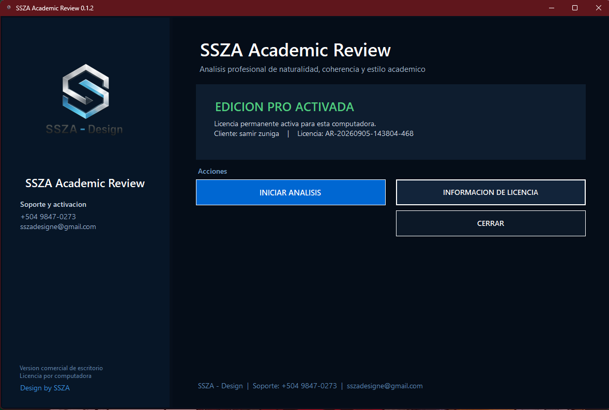
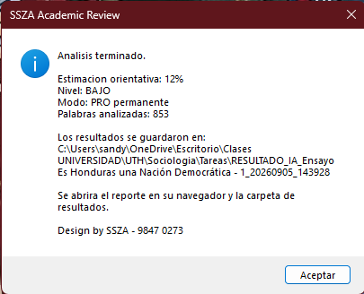
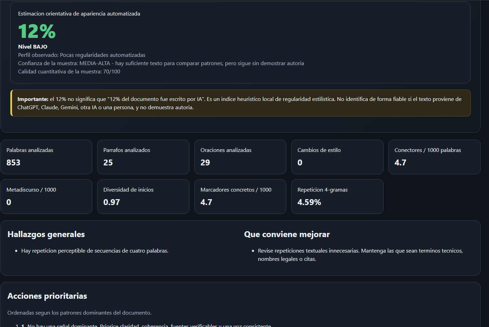
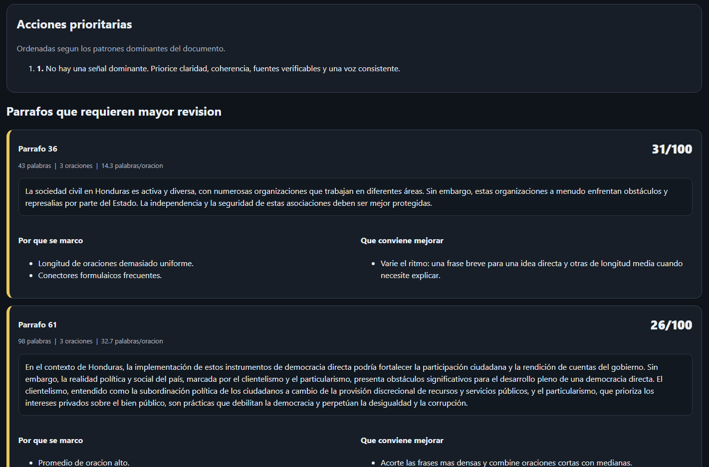
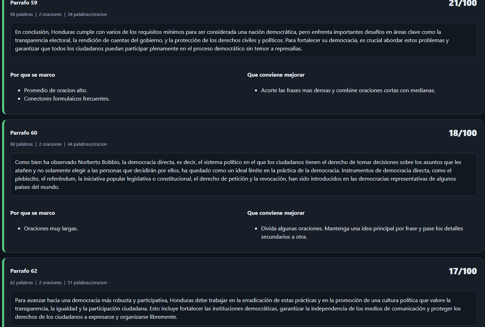

<div align="center">

<p align="center">
  
</p>

### Análisis local de documentos, coherencia, naturalidad y patrones de redacción

**3 análisis GRATIS · Windows · Procesamiento local · PRO $19.99 USD**

[](https://github.com/sszadesign/SSZA-Academic-Review/releases/latest)

[](https://github.com/sszadesign/SSZA-Academic-Review/releases/latest)


**Desarrollado por SSZA - Design**

</div>

---

## ¿Qué es SSZA Academic Review?

**SSZA Academic Review** es una herramienta de escritorio para Windows orientada a revisar documentos de forma local.

Analiza patrones de escritura, estructura, coherencia, ritmo, repetición y regularidad del texto para generar un **índice heurístico orientativo** y recomendaciones concretas de revisión.

> 🔒 **El análisis se realiza localmente en tu computadora.**

---

## ¿Qué analiza?

- Estructura y longitud de oraciones
- Variación del ritmo de escritura
- Repetición de palabras y estructuras
- Frases demasiado formulaicas
- Metadiscurso
- Conectores repetidos
- Cambios bruscos de estilo
- Diversidad de inicios de oración
- Uso excesivo de expresiones genéricas
- Matizadores vagos
- Datos, fechas, ejemplos y referencias concretas
- Texto jurídico o normativo
- Párrafos que necesitan mayor revisión

---

## Resultado del análisis

Al finalizar, SSZA Academic Review genera un reporte con:

- **Índice estimado**
- Nivel de regularidad detectada
- Perfil observado del documento
- Calidad de la muestra analizada
- Hallazgos generales
- Párrafos con mayor riesgo
- Recomendaciones específicas
- Acciones prioritarias
- Reporte HTML
- Reporte de texto
- Datos detallados por párrafo

---

## FREE vs PRO

| Función | FREE | PRO |
|---|:---:|:---:|
| Análisis completo de documentos | ✅ | ✅ |
| Revisión por párrafos | ✅ | ✅ |
| Recomendaciones detalladas | ✅ | ✅ |
| Reporte HTML | ✅ | ✅ |
| Procesamiento local | ✅ | ✅ |
| Número de análisis | **3** | **Ilimitados** |
| Licencia permanente | ❌ | ✅ |
| Precio | Gratis | **$19.99 USD** |

### Edición PRO

**$19.99 USD · Pago único · 1 PC**

No es una suscripción mensual.

---

## Descargar para Windows

### Última versión estable: **v0.1.2**

👉 **[DESCARGAR SSZA ACADEMIC REVIEW](https://github.com/sszadesign/SSZA-Academic-Review/releases/latest)**

Dentro de la Release descarga:

`SSZA_Academic_Review_v0.1.2.exe`

### Requisitos

- Windows 10
- Windows 11
- Se recomienda Windows de 64 bits

---

## Activación PRO

Después de utilizar las pruebas gratuitas puedes activar la edición PRO desde el mismo programa.

### Soporte y activación

**WhatsApp:** +504 9847-0273  
**Correo:** sszadesigne@gmail.com

La licencia PRO se activa para **una computadora**.

---

## Privacidad

SSZA Academic Review está diseñado para realizar su análisis de forma local.

El contenido del documento no necesita enviarse a un servidor externo para ejecutar el análisis heurístico incluido en la aplicación.

---

## Importante sobre el porcentaje

El porcentaje mostrado por SSZA Academic Review es un **índice heurístico orientativo basado en patrones de escritura**.

**No constituye una prueba de autoría.**

La herramienta no puede identificar de manera concluyente si un texto fue escrito por:

- una persona
- ChatGPT
- Claude
- Gemini
- otro modelo de inteligencia artificial

Los resultados deben utilizarse como una herramienta de **apoyo para revisión editorial, académica y profesional**.

---

## Verificación del ejecutable

### SSZA Academic Review v0.1.2

**Archivo**

`SSZA_Academic_Review_v0.1.2.exe`

**SHA-256**

```text
DF1F25B770D6681353093FE4DF98BDB157AEA7DB99401C354E1E2B2CB35E8ECD
```

También puedes descargar `SHA256SUMS.txt` desde la Release correspondiente.

### Verificar en PowerShell

```powershell
Get-FileHash "SSZA_Academic_Review_v0.1.2.exe" -Algorithm SHA256
```

El valor obtenido debe coincidir exactamente con el SHA-256 publicado.

---

## Capturas

### Pantalla principal



### Análisis del documento



### Resultado y recomendaciones



### Resultado y recomendaciones



### Resultado y recomendaciones



## Versiones

### v0.1.2

- Precio PRO corregido a **$19.99 USD**
- Mejoras en análisis heurístico
- Recomendaciones más específicas
- Análisis por párrafo
- Flujo de múltiples análisis
- Mejoras de interfaz
- Validación del motor antes de ejecutar
- Sistema FREE / PRO

Consulta todas las versiones en:

👉 **[Releases](https://github.com/sszadesign/SSZA-Academic-Review/releases)**

---

## Soporte

¿Tienes problemas con la instalación, activación o funcionamiento?

**WhatsApp:** +504 9847-0273  
**Correo:** sszadesigne@gmail.com

---

<div align="center">

### SSZA - Design

**Software · Desarrollo · Soluciones digitales**

© 2026 SSZA - Design. Todos los derechos reservados.

</div>

---

### Aviso de propiedad

SSZA Academic Review es software propietario.

No se autoriza su modificación, ingeniería inversa, reventa, redistribución comercial ni extracción de componentes internos sin autorización expresa de **SSZA - Design**.
